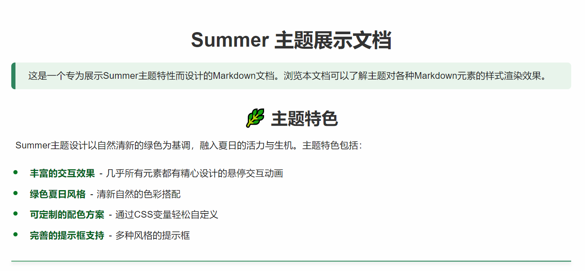
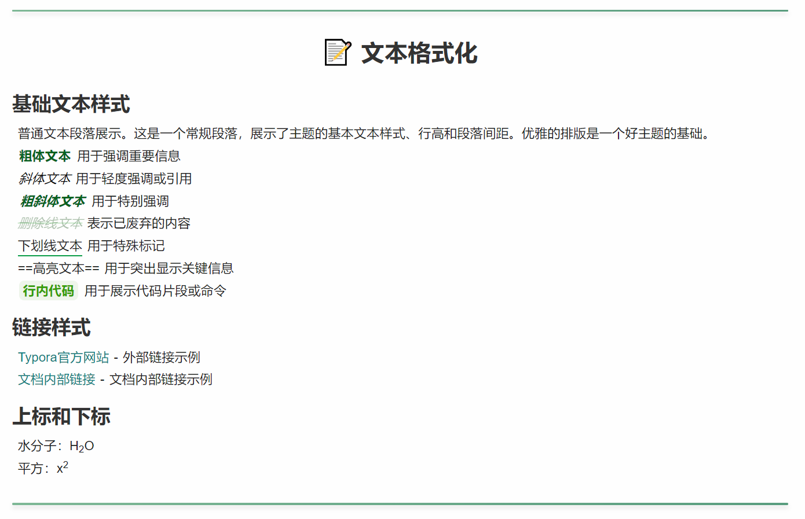
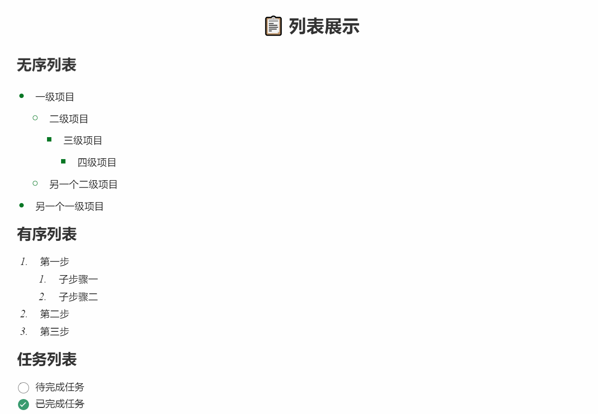

# Summer - Typora Theme



> A custom theme for Typora Markdown editor focusing on fresh summer style, rich interactive experience, and elegant visual effects

## Introduction

* **Rich Interactive Effects** - Almost all elements have carefully designed hover animations that enhance the writing experience
* **Green Summer Style** - Fresh natural green color scheme that conveys the vitality and energy of summer
* **Customizable Color Scheme** - Easily customize theme colors and interactions through CSS variables
* **Complete Alert Box Support** - Includes five different styles of alert boxes: tip, caution, warning, important, and note

## Preview

### Text Styles and Formatting


### Lists and Task Lists


### Blockquotes and Alert Boxes


### Table Styles


### Code Blocks


## Installation

Installing this theme is easy—just move the CSS file into Typora's theme directory.

### Installation Steps

1. Download the CSS file (`summer.css`) from this GitHub repository.
2. Open Typora and go to **`Settings` → `Appearance` → `Open Theme Folder`**.
3. Move the downloaded CSS file into the opened theme folder.
4. Restart Typora and go to **`Settings` → `Appearance`** to select the "Summer" theme.

The theme should now be successfully applied.

## Customization

You can customize the appearance and interactive effects of the theme by modifying the CSS variables at the top of the file:

```css
:root {
  /* Text alignment */
  --text-align: justify;
  
  /* Interactive animation configuration (0: Off, 1: On) */
  --use-dynamic-effect: 1;
  --h1-hover-effect: 1;
  --h2-after-effect: 1;
  --p-hover-effect: 1;
  --img-hover-effect: 1;
  /* More effect variables... */
  
  /* Theme color configuration */
  --body-text-color: #1a1a1a;
  --content-write-bg-color: #fefefe;
  --selection-color: #def2e8;
  /* More color variables... */
}
```

### Interactive Effect Configuration

This theme provides rich interactive animation effects that you can enable or disable according to your preferences:

1. To use all interactive animations, set `--use-dynamic-effect` to `1`
2. To turn off all interactive animations, set `--use-dynamic-effect` to `0`
3. You can also control individual element effects separately (headings, paragraphs, images, etc.)

## Compatibility

This theme was designed and tested on Windows. It should work on other platforms but has not been fully tested.

## Credits

See [credits.md](credits.md) for a complete list of inspirations and acknowledgments.

## License

This project is licensed under the Apache License 2.0 - see the [LICENSE](LICENSE) file for details.

---

If you enjoy this theme, a ⭐ on GitHub would be appreciated!

*[查看中文版](README_zh.md)*

