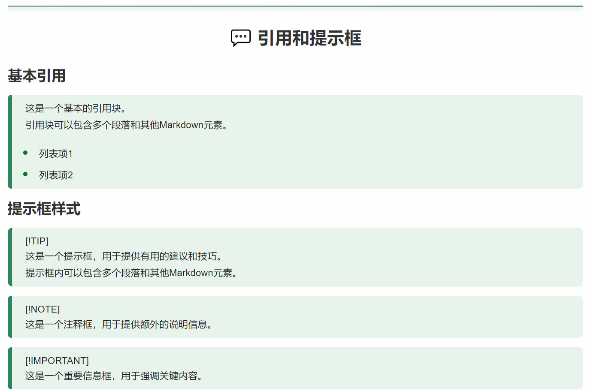
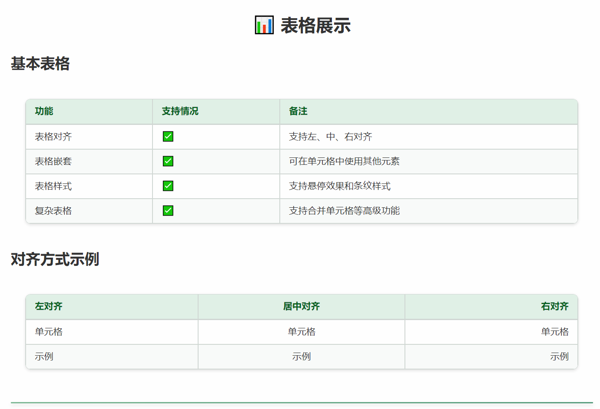
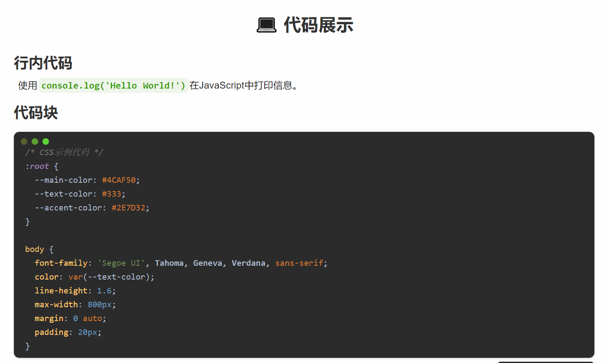

# Summer - Typora主题


> 一款为Typora Markdown编辑器设计的主题，专注于清新自然的夏日风格、丰富的交互体验和优雅的视觉效果

## 简介

* **丰富的交互效果** - 几乎所有元素都有精心设计的悬停交互动画，提升写作体验
* **绿色夏日风格** - 以清新自然的绿色为主色调，呈现夏日的活力与生机
* **可定制的配色方案** - 通过CSS变量轻松自定义主题颜色和交互效果
* **完善的提示框支持** - 包含五种不同风格的提示框：提示(tip)、警告(caution)、注意(warning)、重要(important)和说明(note)

## 预览

### 文本样式和格式


### 列表和任务列表


### 引用和提示框


### 表格样式


### 代码块


## 安装方法

安装此主题非常简单——只需将CSS文件移动到Typora的主题目录中。

### 安装步骤

1. 从此GitHub仓库下载CSS文件（`summer.css`）。
2. 打开Typora，依次点击 **`设置` → `外观` → `打开主题文件夹`**。
3. 将下载的CSS文件移动到打开的主题文件夹中。
4. 重启Typora，然后依次点击 **`设置` → `外观`** 选择"Summer"主题。

主题应该已成功应用。

## 自定义设置

您可以通过修改文件顶部的CSS变量来自定义主题的外观和交互效果：

```css
:root {
  /* 文本对齐方式 */
  --text-align: justify;
  
  /* 交互动画配置（0：关闭，1：开启）*/
  --use-dynamic-effect: 1;
  --h1-hover-effect: 1;
  --h2-after-effect: 1;
  --p-hover-effect: 1;
  --img-hover-effect: 1;
  /* 更多交互效果变量... */
  
  /* 主题颜色配置 */
  --body-text-color: #1a1a1a;
  --content-write-bg-color: #fefefe;
  --selection-color: #def2e8;
  /* 更多颜色变量... */
}
```

### 交互效果配置

本主题提供丰富的交互动画效果，您可以根据个人偏好开启或关闭任意交互效果：

1. 要使用所有交互动画，请将 `--use-dynamic-effect` 设置为 `1`
2. 要关闭所有交互动画，请将 `--use-dynamic-effect` 设置为 `0`
3. 您还可以单独控制各个元素的交互效果（如标题、段落、图片等）

## 兼容性

此主题在Windows上设计和测试。它应该可以在其他平台上工作，但尚未经过全面测试。

## 致谢

查看[credits.md](credits.md)获取完整的灵感来源和致谢名单。

## 许可证

本项目采用Apache License 2.0许可证——详见[LICENSE](LICENSE)文件。

---

如果你喜欢这个主题，在GitHub上点个⭐表示支持将不胜感激！ 