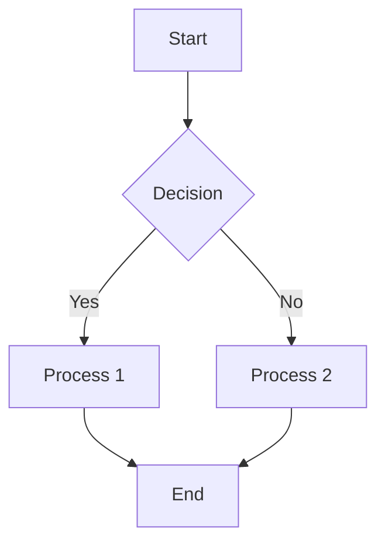

# Theme Demo

This is a demo file to showcase the features of this Typora theme.

## Text Formatting

*Italic text* for emphasis

**Bold text** for strong emphasis

***Bold and italic*** for extra emphasis

~~Strikethrough~~ for deleted text

`Inline code` for code snippets

> Blockquotes for quoted text
>
> Multiple paragraphs in blockquotes

## Lists

### Unordered Lists

* Item 1
* Item 2
  * Nested item 2.1
  * Nested item 2.2
* Item 3

### Ordered Lists

1. First item
2. Second item
3. Third item
   1. Nested numbered item
   2. Another nested item

### Task Lists

- [ ] Incomplete task
- [x] Completed task
- [ ] Another task to do

## Code Blocks

```javascript
// JavaScript code example
function greet(name) {
  console.log(`Hello, ${name}!`);
  return `Welcome, ${name}`;
}

const result = greet('User');
```

```css
/* CSS code example */
:root {
  --main-color: #3370ff;
  --text-color: #333;
}

body {
  font-family: -apple-system, BlinkMacSystemFont, "Segoe UI", Roboto, sans-serif;
  color: var(--text-color);
}
```

## Tables

| Feature     | Support | Notes                           |
| ----------- | ------- | ------------------------------- |
| Headers     | Yes     | Both single and multiline       |
| Alignments  | Yes     | Left, center, and right         |
| Cell styling| Yes     | Through CSS custom properties   |

## Math Equations

Inline math: $E = mc^2$

Display math:

$$
\frac{d}{dx}e^x = e^x
$$

$$
\begin{pmatrix}
1 & 0 & 0 \\
0 & 1 & 0 \\
0 & 0 & 1
\end{pmatrix}
$$

## Diagrams



## Links and Images

[Typora website link](https://typora.io)


## Horizontal Rule

---

## Footnotes

Here's a sentence with a footnote[^1].

[^1]: This is the footnote content.

## HTML Support

<div style="background-color: #f0f0f0; padding: 10px; border-radius: 5px;">
  <p>Custom HTML block with styling</p>
  <span style="color: red;">Colored text</span>
</div>

## Heading Hierarchy

# Heading 1
## Heading 2
### Heading 3
#### Heading 4
##### Heading 5
###### Heading 6 