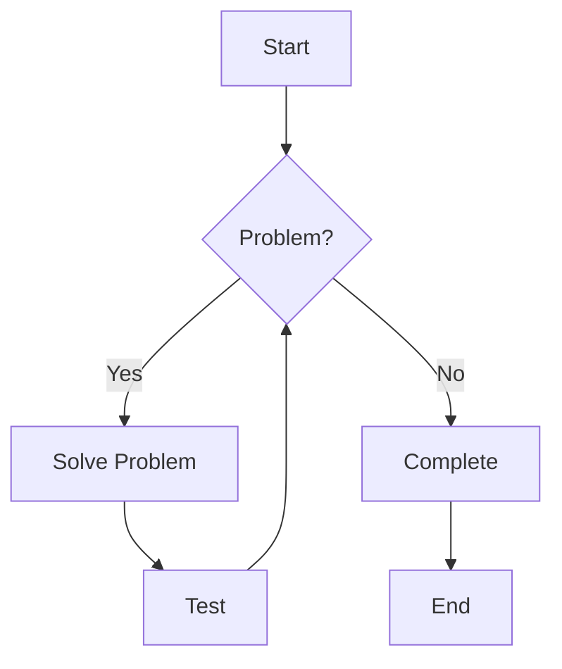
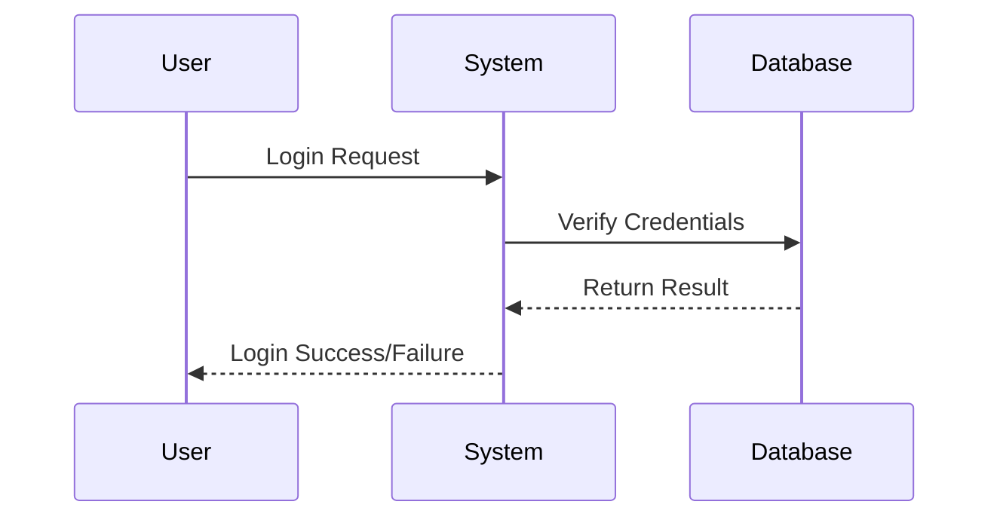

# Summer Theme Showcase

> This is a Markdown document designed specifically to showcase the features of the Summer theme. Browse this document to see how the theme renders various Markdown elements.

## 🌿 Theme Features

The Summer theme design is based on fresh, natural green tones that incorporate the vitality and energy of summer. Theme features include:

* **Rich Interactive Effects** - Almost all elements have carefully designed hover animations
* **Green Summer Style** - Fresh, natural color palette
* **Customizable Color Scheme** - Easily customize through CSS variables
* **Complete Alert Box Support** - Multiple styles of alert boxes

---

## 📝 Text Formatting

### Basic Text Styles

Normal paragraph text display. This is a regular paragraph that showcases the theme's basic text style, line height, and paragraph spacing. Elegant typography is the foundation of a good theme.

**Bold text** for emphasizing important information

*Italic text* for mild emphasis or quotation

***Bold and italic text*** for special emphasis

~~Strikethrough text~~ for deprecated content

<u>Underlined text</u> for special marking

==Highlighted text== for emphasizing key information

`Inline code` for displaying code snippets or commands

### Link Styles

[Typora Official Website](https://typora.io) - External link example

[Internal Document Link](#table-display) - Example of internal document link

### Superscript and Subscript

Water molecule: H<sub>2</sub>O

Square: x<sup>2</sup>

---

## 📋 List Display

### Unordered Lists

* First level item
  * Second level item
    * Third level item
      * Fourth level item
  * Another second level item
* Another first level item

### Ordered Lists

1. First step
   1. Sub-step one
   2. Sub-step two
2. Second step
3. Third step

### Task Lists

- [ ] Incomplete task
- [x] Completed task
- [ ] Important to-do item
- [x] Resolved issue

---

## 💬 Blockquotes and Alert Boxes

### Basic Blockquote

> This is a basic blockquote.
>
> Blockquotes can contain multiple paragraphs and other Markdown elements.
>
> * List item 1
> * List item 2

### Alert Box Styles

> [!TIP]
> This is a tip box for providing useful advice and tips.
> 
> Tip boxes can contain multiple paragraphs and other Markdown elements.

> [!NOTE]
> This is a note box for providing additional explanatory information.

> [!IMPORTANT]
> This is an important information box for emphasizing key content.

> [!WARNING]
> This is a warning box to alert users to potential issues.

> [!CAUTION]
> This is a caution box to remind users to be careful with operations and avoid serious problems.

---

## 📊 Table Display

### Basic Table

| Feature     | Support | Notes                           |
| ----------- | ------- | ------------------------------- |
| Table Alignment | ✅   | Supports left, center, and right alignment |
| Table Nesting | ✅     | Can use other elements in cells |
| Table Styling | ✅     | Supports hover effects and striped styles |
| Complex Tables | ✅    | Supports advanced features like merged cells |

### Alignment Example

| Left Aligned | Center Aligned | Right Aligned |
| :----------- | :------------: | ------------: |
| Cell         | Cell           | Cell          |
| Example      | Example        | Example       |

---

## 🖼️ Image Display


*Images have subtle zoom and shadow effects on hover*

---

## 💻 Code Display

### Inline Code

Use `console.log('Hello World!')` to print messages in JavaScript.

### Code Blocks

```css
/* CSS code example */
:root {
  --main-color: #4CAF50;
  --text-color: #333;
  --accent-color: #2E7D32;
}

body {
  font-family: 'Segoe UI', Tahoma, Geneva, Verdana, sans-serif;
  color: var(--text-color);
  line-height: 1.6;
  max-width: 800px;
  margin: 0 auto;
  padding: 20px;
}
```

```python
# Python code example
def fibonacci(n):
    """Generate the first n numbers of the Fibonacci sequence"""
    a, b = 0, 1
    for _ in range(n):
        yield a
        a, b = b, a + b

# Create generator object
fib = fibonacci(10)

# Print the first 10 Fibonacci numbers
print(list(fib))

# Class definition example
class Animal:
    def __init__(self, name, species):
        self.name = name
        self.species = species
        
    def make_sound(self):
        pass
    
    def __str__(self):
        return f"{self.name} is a {self.species}"

# Inheritance
class Cat(Animal):
    def __init__(self, name, breed):
        super().__init__(name, species="Cat")
        self.breed = breed
        
    def make_sound(self):
        return "Meow!"
```

---

## 📐 Math Equations

### Inline Formulas

Einstein's mass-energy equation: $E = mc^2$

Euler's formula: $e^{i\pi} + 1 = 0$

### Formula Blocks

$$
\frac{d}{dx}\left( \int_{a}^{x} f(t)dt \right) = f(x)
$$

$$
\begin{aligned}
\nabla \times \vec{\mathbf{B}} -\, \frac1c\, \frac{\partial\vec{\mathbf{E}}}{\partial t} & = \frac{4\pi}{c}\vec{\mathbf{j}} \\
\nabla \cdot \vec{\mathbf{E}} & = 4 \pi \rho \\
\nabla \times \vec{\mathbf{E}}\, +\, \frac1c\, \frac{\partial\vec{\mathbf{B}}}{\partial t} & = \vec{\mathbf{0}} \\
\nabla \cdot \vec{\mathbf{B}} & = 0
\end{aligned}
$$

Matrix example:

$$
\begin{pmatrix}
a_{11} & a_{12} & a_{13} \\
a_{21} & a_{22} & a_{23} \\
a_{31} & a_{32} & a_{33}
\end{pmatrix}
$$

---

## 📊 Diagrams





---

## 🔍 Other Elements

### Horizontal Rules

Different styles of dividers:

---

***

### Footnotes

This is text with a footnote[^1]. You can create more footnotes[^2].

[^1]: This is the content of the first footnote.
[^2]: This is the content of the second footnote, which can include multiple lines of text.

### HTML Support

<div style="padding: 15px; background-color: #e8f5e9; border-radius: 5px; border-left: 5px solid #4CAF50;">
  <h4 style="margin-top: 0; color: #2E7D32;">HTML Custom Block</h4>
  <p>This is a custom content block created using HTML.</p>
  <p>More complex layouts and styles can be implemented using HTML.</p>
</div>

---

## 📚 Heading Hierarchy Display

# Heading 1
Example content

## Heading 2
Example content

### Heading 3
Example content

#### Heading 4
Example content

##### Heading 5
Example content

###### Heading 6
Example content

---

## 🎨 Theme Interactive Effects

A major feature of the Summer theme is its rich interactive effects. When you hover your mouse over the following elements, you can experience carefully designed animation effects:

- Headings (all levels)
- Paragraphs
- Images
- Table rows and cells
- Code blocks
- List items
- Blockquotes and alert boxes
- Links
- Rich text formats (bold, italic, strikethrough, etc.)

---

*Thank you for using the Summer theme! We hope this sample document helps you showcase all the features of the theme.* 